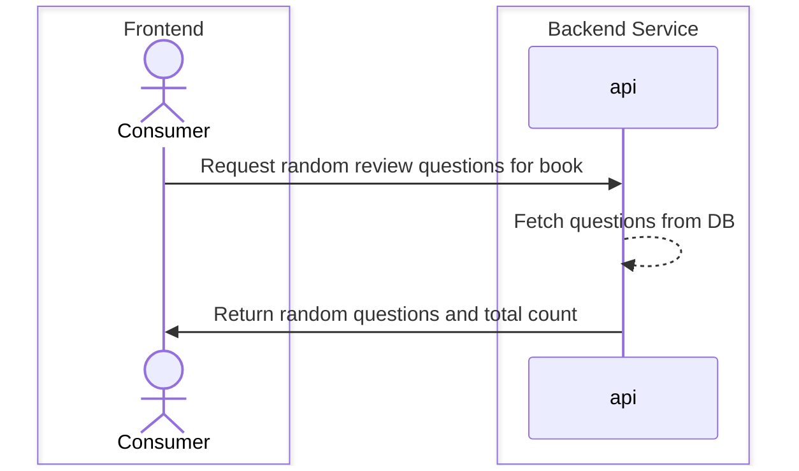
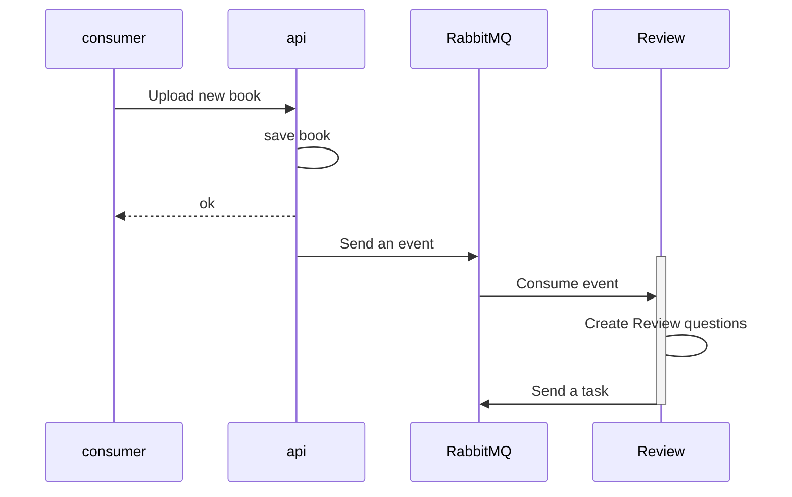

## Description
Book Service focused on the Study Tool review questions.
### Api

### Review Service
Review service is responsible of generating review questions for a newly uploaded book. Generating a review is a long running task.

