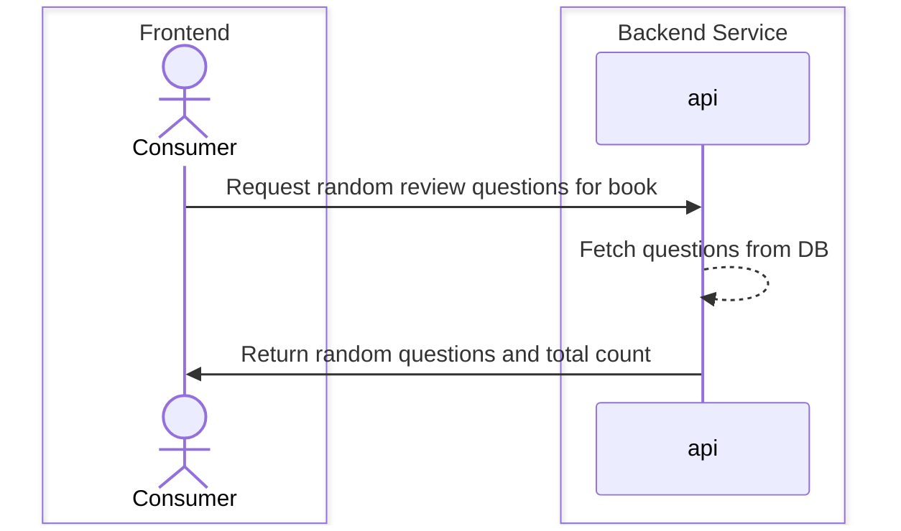

## Description
Book Service focused on the Study Tool review questions.

```mermaid
    sequenceDiagram
    box Frontend
        actor c as Consumer
    end
    box Backend Service
        participant api
    end
    c->>api: Request random review questions for book
    api-->>api: Fetch questions from DB
    api->>c: Return random questions and total count
```